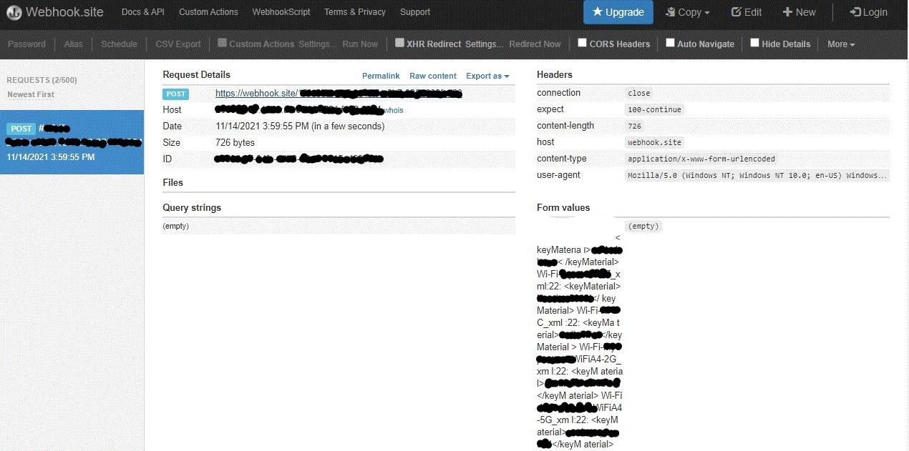

# Rubber Ducky

  
    
  
   
  
   
  
   
  
   
  
  
  ## Description
  
  A rubber ducky grabs stored wifi passwords on windows and sends them as plain text to your webhook page which you can see later.
   There are two different files and both have same functionalty, the only difference is how the cmd window on the target PC will be be displayed. 
   PLEASE NOTE: The cmd window WILL open once the ducky is inserted and could attract attention. So it would be wise to use file #2... 
   If you happen to be a ninja or have one heck of a cover for action prepared then file #1 could work for you. 

**1.** wifi-key-grab.ino: 
Starts cmd in a small window in order to grab less attention

**2.** wifi-key-grab-min.ino: 
Starts cmd in a small window but also hides the cmd by scrolling it down the screen method defined in hak5darren's rubberducky wiki [Payload hide cmd window](https://github.com/hak5darren/USB-Rubber-Ducky/wiki/Payload---hide-cmd-window)

 ## Disclaimer

 * All the software/hardware/scripts/applications/tactics in this repository are provided as is, without warranty of any kind. Use of these software/scripts/applications/things is entirely at your own risk. 
  The creator of these software/hardware/scripts/applications/tactics is not responsible for any direct or indirect damage to your own or someone else's property resulting from the use of these software/hardware/scripts/applications/tactics.
 
 * these software/hardware/scripts/applications/tactics is NOT intended to be used for malicious purposes, but if you are using it for malicious purposes, you are responsible for all the consequences of your actions.

 * This technology is intended to be used for ethical penetration testing ONLY. So please do not use it for illegal purposes.
 
 * Don't do anything stupid!
  ## Table of Contents
  - [Description](#description)
  - [Disclaimer](#disclaimer)
  - [Documentation](#documentation)
  - [Usage](#usage)
  - [Screenshot](#screenshot)
  - [Acknowledgements](#acknowledgements)
  - [License](#license)
  - [Testing](#testing)
  - [Contact](#contact)

  ## Documentation
  **Password Grabber** <https://webhook.site/> 
  **Arduino Compiler** <https://www.arduino.cc/reference/en/> 
  **Digistump Wiki** <http://digistump.com/wiki/digispark>
 
  ## Usage
  Covertly obtain wifi passwords for penetration testing.

  ## Screenshot
   
   
  # Acknowledgements
  
  * Muhammad Talha Khan - MTK911
     
  Github link <https://github.com/MTK911/Attiny85/>

    
  ## License
  
   
  Permission to use this application is granted under the MIT license. <https://opensource.org/licenses/MIT>

  ## Testing
**OS**: Windows 10 
 
<https://webhook.site/>
 
**User**: Admin
 
**Hardware**: ATtiny85 
 
 

  ## Contact:
  Holler at me! <a href="mailto:rob.atalla@robatalla816.com">rob.atalla@robatalla816.com</a>
