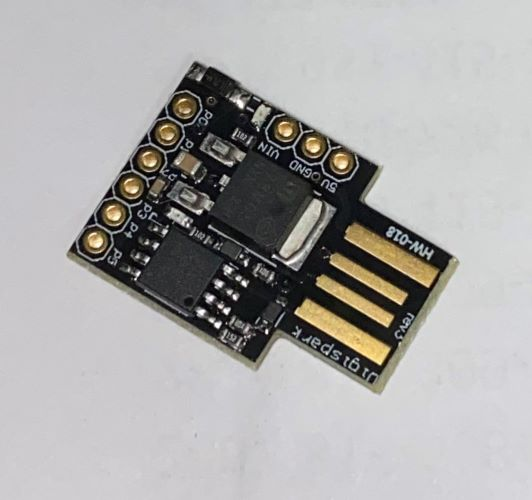

# Rubber Ducky

  
    
  
   
  
   
  
   
  
   
  
  
  ## Description
  
  As the name suggests it grabs stored wifi passwords on windows and send their plain text to your webhook page which you can see later. There are two different files and both have same functionalty the only difference is how cmd windows is going to be hidden from display.

**1.** wifi-key-grab.ino: 
Starts cmd in a small window in order to grabs less attention

**2.** wifi-key-grab-min.ino: 
Starts cmd in a small window but also hides the cmd by scrolling it down the screen method defined in hak5darren's rubberducky wiki [Payload hide cmd window](https://github.com/hak5darren/USB-Rubber-Ducky/wiki/Payload---hide-cmd-window)

 
  ## Table of Contents
  - [Description](#description)
  - [Documentation](#documentation)
  - [Usage](#usage)
  - [Screenshot](#screenshot)
  - [Features](#features)
  - [Acknowledgements](#acknowledgements)
  - [License](#license)
  - [Testing](#testing)
  - [Contact](#contact)

  ## Documentation
  **Password Grabber**: https://webhook.site/ or any other request reflector of your choice 
**Internet Access**
 
  ## Usage
  Covertly obtain wifi passwords from target networks through physical comprimise.

  ## Screenshot
   
<kbd>

</kbd>

  ## Features
  TBD
  
  # Acknowledgements
  
  * Muhammad Talha Khan - MTK911
     
  Github link <https://github.com/MTK911/Attiny85/>

    
  ## License
  
   
  Permission to use this application is granted under the MIT license. <https://opensource.org/licenses/MIT>

  ## Testing
**OS**: Windows 10 Pro
 
**User**: Admin Priviliged
 
**Hardware**: ATtiny85 (Chinese)

  ## Contact:
  Holler at me! <a href="mailto:rob.atalla@robatalla816.com">rob.atalla@robatalla816.com</a>
