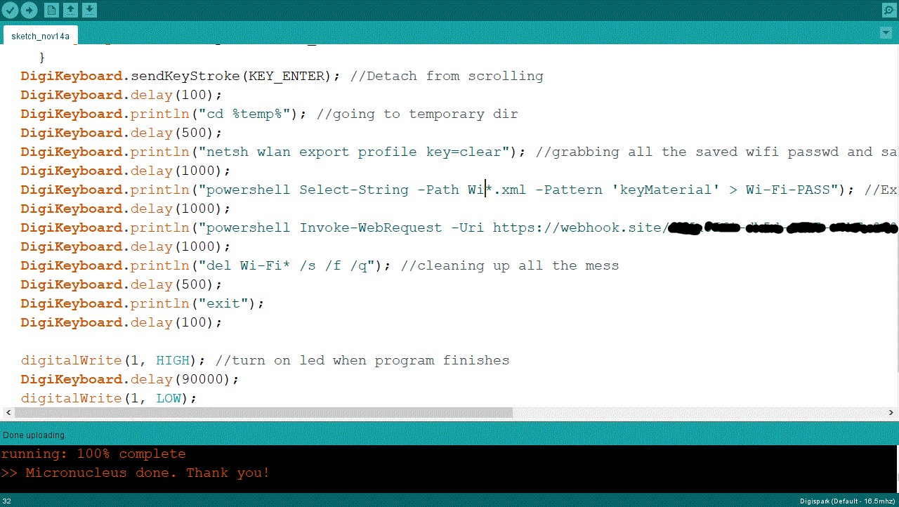

# Rubber Ducky

  
    
  
   
  
   
  
   
  
   
  
  
  ## Description
  
  A rubber ducky grabs stored wifi passwords on windows and send their plain text to your webhook page which you can see later. There are two different files and both have same functionalty the only difference is how cmd windows is going to be hidden from display.

**1.** wifi-key-grab.ino: 
Starts cmd in a small window in order to grabs less attention

**2.** wifi-key-grab-min.ino: 
Starts cmd in a small window but also hides the cmd by scrolling it down the screen method defined in hak5darren's rubberducky wiki [Payload hide cmd window](https://github.com/hak5darren/USB-Rubber-Ducky/wiki/Payload---hide-cmd-window)

 ## Disclaimer

 * All the software/scripts/applications/things in this repository are provided as is, without warranty of any kind. Use of these software/scripts/applications/things is entirely at your own risk. Creator of these softwares/scripts/applications/things is not responsible for any direct or indirect damage to your own or someone else's property resulting from the use of these software/scripts/applications/things.
 
 * This software/scripts/applications/things is NOT intended to be used for malicious purposes, but if you are using it for malicious purposes, you are responsible for all the consequences of your actions.
  ## Table of Contents
  - [Description](#description)
  - [Disclaimer](#disclaimer)
  - [Documentation](#documentation)
  - [Usage](#usage)
  - [Screenshot](#screenshot)
  - [Acknowledgements](#acknowledgements)
  - [License](#license)
  - [Testing](#testing)
  - [Contact](#contact)

  ## Documentation
  **Password Grabber** <https://webhook.site/> 
  **Arduino Compiler** <https://www.arduino.cc/reference/en/> 
  **Digistump Wiki** <http://digistump.com/wiki/digispark>
 
  ## Usage
  Covertly obtain wifi passwords for penetration testing.

  ## Screenshot
   
   
  # Acknowledgements
  
  * Muhammad Talha Khan - MTK911
     
  Github link <https://github.com/MTK911/Attiny85/>

    
  ## License
  
   
  Permission to use this application is granted under the MIT license. <https://opensource.org/licenses/MIT>

  ## Testing
**OS**: Windows 10 
 
<https://webhook.site/>
 
**User**: Admin Priviliged
 
**Hardware**: ATtiny85 
 
 

  ## Contact:
  Holler at me! <a href="mailto:rob.atalla@robatalla816.com">rob.atalla@robatalla816.com</a>
